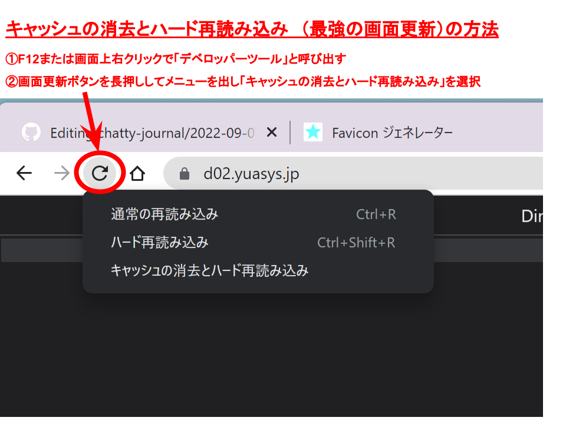

# 2022-09-07.md
  
---

### [◀️前日へ](https://github.com/yuasys/chatty-journal/blob/main/2022/09/2022-09-06.md)&emsp;&emsp;&emsp;&emsp;[翌日へ▶️](https://github.com/yuasys/chatty-journal/blob/main/2022/09/2022-09-08.md)

---

## 今日困ったこと

### faviconを設定しても表示されない❢

#### 解決法（あっているかどうかは未検証）

1. コードは最小限として余計なことは一切書かなかった

```html
<link rel="icon" href="./img/favicon.ico">
```

2. favicon.icoファイルは新規に作成した

- オンラインツール：[ファビコンジェネレータ](https://favicon-generator.mintsu-dev.com/)を利用

- 素材は以前作成した[pngファイル](https://github.com/yuasys/chatty-journal/blob/main/images/yuasys120.png?raw=true)を再利用

 <div></div>
3. 画面のキャッシュデータを最も強い方法で削除・更新した
 <div></div>

## Jimd2Wordpressの取り組み

### favicon.icoの表示ができなくて困った

#### 解決法（あっているかどうか未検証）

1. コードはミニマムにした

```html
<link rel="icon" href="./img/favicon.ico">
```

2. favicon.icoは64x64で新規制作した  
使ったツールはオンラインサービスの[ファビコンジェネレータ](https://favicon-generator.mintsu-dev.com/)
