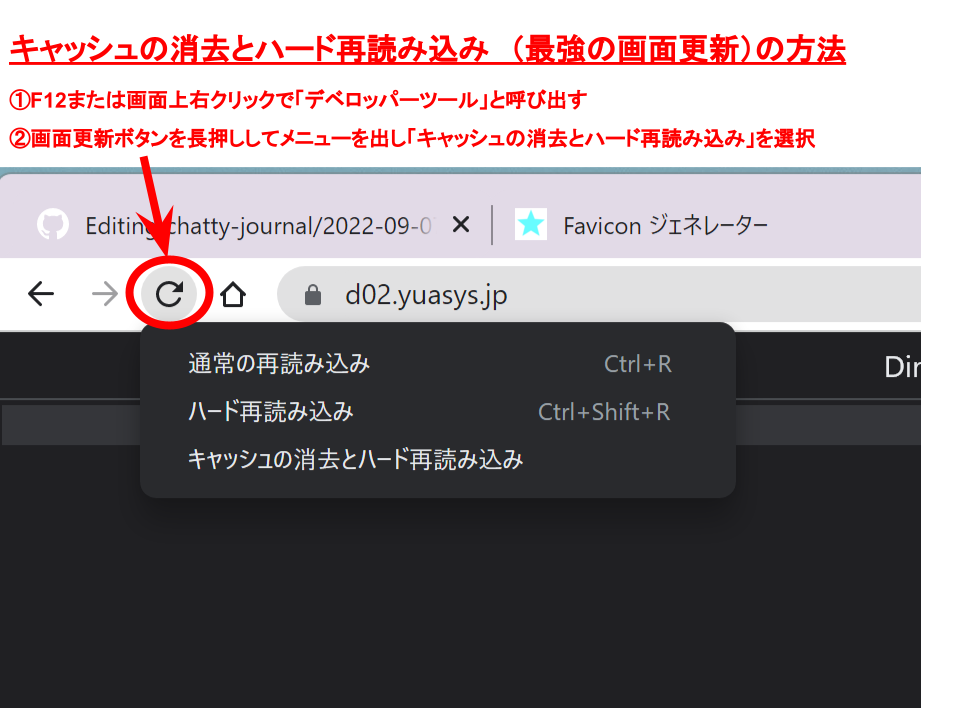

# 2022-09-19.md

<h2 style="display:inline">今日の課題と実績</h2>

 <h3>やりたいこと/やったこと</h3>
 <ol>
  <li>Next.jsチュートリアルを演習（つづき）</li>
    
   
 詳しいソースコードなどの成果物は<a href="https://github.com/yuasys/nextjs-blog.git">このリポジトリ</a>を参照してください。 
    また、学習経過や参考メモは<a href="https://docs.google.com/document/d/1D6LQcBH2jFP820-rI8iaqd67tvonRbR3z0iPZJp3gEM/edit#">ここ（閲覧権限者に限定公開）</a>に記録しました。
  

 </ol>
 

 
<h2 style="display:inline">今日の気づき&nbsp;</h2><small><i>new</i></small>

 <ul>
  <li>Next.jsチュートリアルをやってみたら、実は前にも一度勉強したことであることに気づいた。</li>
  <li>チュートリアルをやっても単なるコピペだと、ほぼスキルの蓄積はゼロであることが分かった。</li>
  <li>十分考えながら、何故、どうしてこのように書かないといけないのか？別の書き方をしたらどうなるのか、、、と、興味と実験する心を持ちながら勉強を進めることが大切だと分かった。</li>
 
 </ul>
 

 

  
<h2 style="display:inline">最近使ってみて便利だったツール</h2>

  <ul>
   <li>オンラインツール：<a href="https://favicon-generator.mintsu-dev.com/">ファビコンジェネレータ</a>で任意の画像をfaviconに変換</li>
   <li>オンラインツール：<a href="https://placehold.jp/">プレスホルダー</a>で任意サイズのダミー画像を生成</li>
  </ul>

 

  
<h2 style="display:inline"?>最近習得してやってみたら有効だった技</h2>

 
  <ul>
   <li>Vscodeエディタでlorem20とするとワード数２０のダミー段落が得られる。</li>
   <li>画面のキャッシュデータの削除／更新</li>
   

  </ul>

## memo
[CSS基礎講座](https://youtube.com/playlist?list=PLwM1-TnN_NN5jWN09yjtxWng2XZa88ate)  
[HTML&CSSレイアウト講座](https://youtube.com/playlist?list=PLwM1-TnN_NN5x6_-OTH9BFVgbYg_l7oEN)  
頻尿の話：
  9/13 一昨晩に引き続き、昨晩も連続５時間半ほど連続睡眠を確保できた。２日連続はとてもうれしい。  
  9/12 昨晩２２：３０就寝、けさ０４：３０連続６時間睡眠確保できたのは数年ぶり。よかった。
