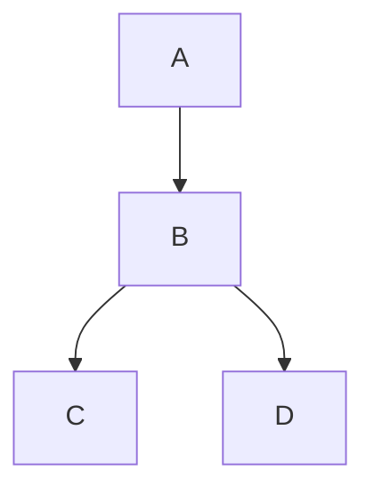

# 2023-02-24.md

---

### [◀️前日へ](https://github.com/yuasys/chatty-journal/blob/main/2023/02/2023-02-23.md)&emsp;&emsp;&emsp;&emsp;[翌日へ▶️](https://github.com/yuasys/chatty-journal/blob/main/2023/02/2023-02-25.md)

---

## GitHubのREADME.mdに直接フローチャート書けるってよ❗

「へぇ〜本当に？...」というわけで早速やってみました。

### 先頭の行にラインの方向を書いてみる

| 方向 | 書き方 | 備考 |
|----|----|----|
|縦|graph TD |Top Downと覚える|
|横|graph LR|Left to Rightと覚える|

#### 左から右に横に線でつないでみた

|ソースコード|表示|
|----|----|
|graph LR &nbsp;&nbsp;&nbsp;&nbsp;A --> B &nbsp;&nbsp;&nbsp;&nbsp;B --> C &nbsp;&nbsp;&nbsp;&nbsp;C --> D||

上記のように書くと、バッククオートが単独で表示されます。

