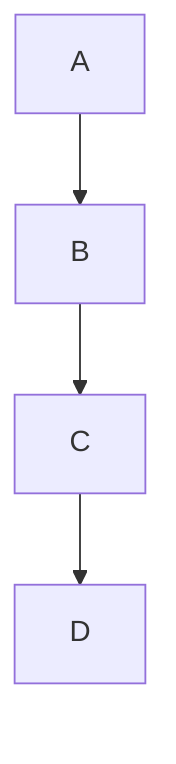

# 2023-02-24.md

※この記事は、ほとんど2023-02-26に追記しました

## GitHubのREADME.mdに直接フローチャート書けるってよ！

というわけで早速やってみました。

```mermaid
graph LR
    A --> B
    B --> C
    C --> D
```

```mermaid
graph TD
    A --> B
    B --> C
    C --> D
```
