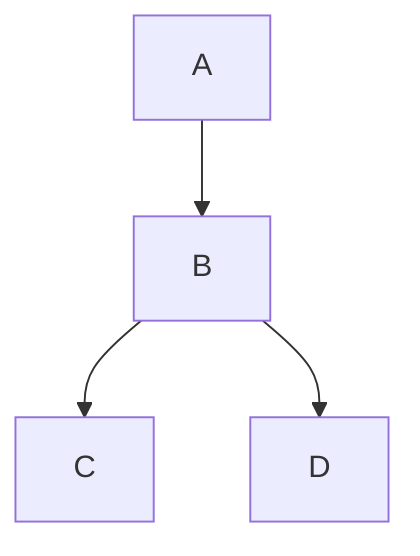

# 2023-03-12

---

### [◀️前日へ](https://github.com/yuasys/chatty-journal/blob/main/2023/03/2023-03-11.md)&emsp;&emsp;&emsp;&emsp;[翌日へ▶️](https://github.com/yuasys/chatty-journal/blob/main/2023/03/2023-03-13.md)

---

## GitHubのREADME.mdに直接フローチャート書けるってよ！【追補版】

「へぇ〜本当に？...」というわけで早速やってみました。

### 先頭の行にラインの方向を書いてみる

| 方向 | 書き方 | 備考 |
|----|----|----|
|縦|graph TD |Top Downと覚える|
|横|graph LR|Left to Rightと覚える|

#### 左から右に横に線でつないでみた

|ソースコード|表示|
|----|----|
|graph LR &nbsp;&nbsp;&nbsp;&nbsp;A --> B &nbsp;&nbsp;&nbsp;&nbsp;B --> C &nbsp;&nbsp;&nbsp;&nbsp;C --> D||

備考：``&#96;``と書くことにより、back quote（&#96;）をHTMLエスケープなしに直接表示させることができます。一般的なHTML記号のHTML直接表示に関しては[このサイト](https://blog.codecamp.jp/html-special-character)が便利です

