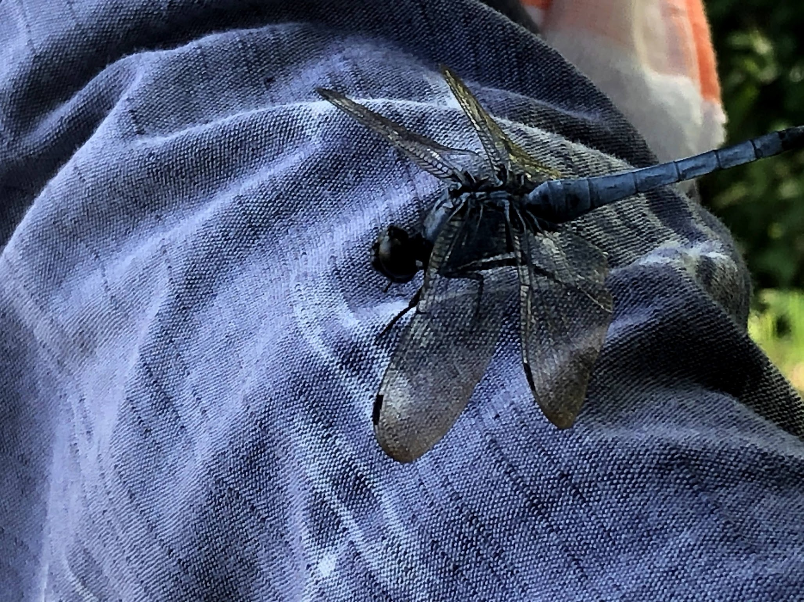

# README

記事を追加・削除した場合は「前の記事へ」と「次の記事へ」ボタンのリンクを更新する必要が有ります。  
記事投稿日が近隣でしたら、手動で修正するのも簡単ですが、投稿日が離れていた場合は手動ではとても困難な作業となります。  
そこで、全記事をチェックして全自動でリンクを再調整し、加えてGitHub（リモートリポジトリ）への反映までも自動実行してくれる。便利なスクリプトを開発しました。  
<b>ターミナルでローカルリポジトリに移動してから下記のコマンドを実行します。</b>  


```zsh
./update-navigation.sh
```

## chatty-journal-yyyymmdd の雛形について

### 雛形サンプル１

<hr/>

```html
<details>
<summary><h2 style="display:inline">アコーディオンひな形</h2></summary>
 <h3>タイトル</h3>
 <ol>
  <li>番号付きリスト</li>
  <li></li>
 </ol>
 <ul>
  <li>記号付きリスト</li>
  <li></li>
 </ul>
 <p>画像の利用</p>
 <div></div>
</details>
```

<hr/>

<hr/>
<details>
<summary><h2 style="display:inline">アコーディオンひな形</h2></summary>
 <h3>タイトル</h3>
 <ol>
  <li>番号付きリスト</li>
  <li></li>
 </ol>
 <ul>
  <li>記号付きリスト</li>
  <li></li>
 </ul>
 <p>画像の利用</p>
 <div></div>
</details>

<hr/>

<details>
 <summary><h3>目次</h3></summary>
 <p><a href="#">コンテンツ1</a></p>
 <p><a href="#">コンテンツ2</a></p>
<p><a href="#">コンテンツ3</a></p>
<p>><a href="#">コンテンツ4</a></p>
</details>

## 雛形サンプル２

---

```md
# 2026年01月7日（水）

---

### [◀️前日へ](https://github.com/yuasys/chatty-journal/blob/main/2026/01/2026-01-06.md)&emsp;&emsp;&emsp;&emsp;[翌日へ▶️](https://github.com/yuasys/chatty-journal/blob/main/2026/01/2026-01-07.md)

---

---

### [◀️前の記事へ](https://github.com/yuasys/chatty-journal/blob/main/2025/12/2025-12-29.md)&emsp;&emsp;&emsp;&emsp;[次の記事へ▶️](https://github.com/yuasys/chatty-journal/blob/main/2026/01/2026-01-07.md)
```

# 2026年01月7日（水）

---

### [◀️前日へ](https://github.com/yuasys/chatty-journal/blob/main/2026/01/2026-01-06.md)&emsp;&emsp;&emsp;&emsp;[翌日へ▶️](https://github.com/yuasys/chatty-journal/blob/main/2026/01/2026-01-07.md)

---

---

### [◀️前の記事へ](https://github.com/yuasys/chatty-journal/blob/main/2025/12/2025-12-29.md)&emsp;&emsp;&emsp;&emsp;[次の記事へ▶️](https://github.com/yuasys/chatty-journal/blob/main/2026/01/2026-01-07.md)
```


